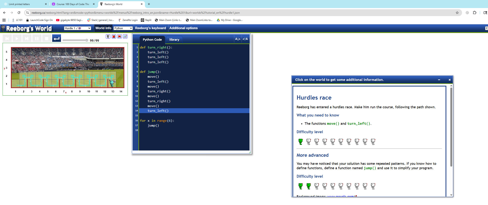

A function in its simplest form is just a wrapper name for a block of code. You give it name and then when you call the function by that name, all the code within the function block will be executed. It can help us save time and reduce repeated code.

### Defining a new Function
```
def <function name>():
    print("Hello")
    # Do something else
    # Do something else ...
```

### Calling a Function
Calling a function just means triggering the function. We can call a function at any point in our code in Python. 

```
<function name>()
```

Putting everything together e.g.
```
#Creating the function
def get_user_name():
    name = input("What is your name? ")
    print("Hello, " + name)
    # Inside the function

#Outside the function
print("Hello")
get_user_name() # Calling the function
```

This code will result in the following sequence of output:
```
Hello
What is your name? #I type Angela
Hello
Angela
```

